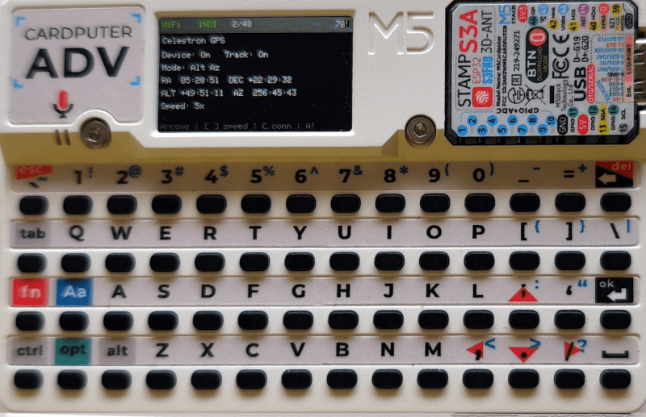

# Cardputer INDI Controller

A handheld Wi-Fi controller for astronomical equipment exposed through an
[INDI](https://indilib.org/) server, built for the M5Stack Cardputer ADV.

The controller discovers INDI devices at runtime and provides dedicated screens for telescope
mounts and cameras, plus a generic read-only property inspector. It is designed for common field
operations without requiring a phone or laptop at the telescope.



## Features

- On-device Wi-Fi selection and persistent INDI server configuration.
- Automatic INDI device and property discovery.
- Generic device, property, and member inspector.
- Telescope status display:
  - Connection and tracking state.
  - Tracking mode and slew speed.
  - RA/Dec and Alt/Az coordinates when available.
- Telescope controls:
  - Hold-to-nudge motion in four directions.
  - Selectable slew rates.
  - Emergency motion abort.
  - Compare the mount's configured location and UTC with live GNSS data.
  - Send a valid GNSS position and UTC to compatible mounts.
- Camera controls:
  - Select exposure time and trigger capture through standard `CCD_EXPOSURE`.
  - Select ISO when the driver exposes a writable ISO switch property.
- Automatic Wi-Fi and INDI server reconnection.
- Automatic GNSS expansion-module detection from valid NMEA traffic.
- GNSS status screen with UTC, latitude, longitude, 3D-fix elevation, satellite count, fix status,
  and HDOP.
- Battery percentage in the status bar.
- INDI BLOB transfers disabled to avoid downloading images to the Cardputer.

## Compatibility

The controller is capability-based. It discovers standard INDI properties instead of depending on
a specific telescope or camera model.

Mount control uses properties such as:

- `CONNECTION`
- `EQUATORIAL_EOD_COORD`
- `HORIZONTAL_COORD`
- `TELESCOPE_TRACK_STATE`
- `TELESCOPE_TRACK_MODE`
- `TELESCOPE_MOTION_NS`
- `TELESCOPE_MOTION_WE`
- `TELESCOPE_SLEW_RATE`
- `TELESCOPE_ABORT_MOTION`
- `GEOGRAPHIC_COORD`
- `TIME_UTC`

Camera capture uses the standard `CCD_EXPOSURE` property. ISO control is available only when the
camera driver exposes a compatible writable ISO switch property. Vendor-specific DSLR actions,
shutter-preset properties, image previews, and image downloads are not supported.

Driver support does not guarantee that the physical device implements every advertised property.
The INDI driver and equipment configuration determine which controls are available and whether the
device honors them.

## Controls

The Cardputer's printed punctuation keys act as directional arrows:

| Key | Action |
| --- | --- |
| `;` | Up |
| `.` | Down |
| `,` | Left / back |
| `/` | Right / open |
| Enter | Open |
| Backspace | Back |
| `S` | Open settings from the device list |
| `G` | Open GNSS status from the device list when a module is detected |

### GNSS Screen

The Cardputer ADV Cap LoRa868 GPS UART is monitored at `115200` baud on `G15` (RX) and `G13` (TX),
matching the official Cardputer ADV demo. The firmware queries the module with `$PCAS06,0*1B` and
also accepts any checksum-valid NMEA sentence as device detection. The header's `GNSS` indicator is
red when absent, yellow when detected without an explicit GSA 3D fix, and green with a 3D fix. If
the module stops sending data, the screen retains the last values and marks the module stale.

The live screen displays UTC, latitude, longitude, satellite count, fix dimension, and HDOP.
Elevation is parsed from NMEA GGA altitude in meters and is displayed only while the receiver
reports an explicit 3D fix.

### Mount Screen

| Key | Action |
| --- | --- |
| Hold arrow keys | Nudge north, south, west, or east |
| Release arrow key | Stop motion on that axis |
| `[` / `]` | Previous / next slew rate |
| `C` | Connect / disconnect |
| `G` | Compare mount location/time with GNSS |
| `A` | Emergency motion abort |
| Enter | Open property inspector |
| Backspace | Return to device list |

The mount GPS comparison screen shows the currently configured mount latitude, longitude, and UTC
alongside the live GNSS values. The cached mount UTC advances locally every second for an easier
comparison and re-anchors whenever the INDI driver reports a changed `TIME_UTC` value.

Press Enter on the comparison screen to send the GNSS position and UTC. Synchronization requires:

- A current valid GNSS fix, location, and date/time.
- An active INDI connection.
- Writable `GEOGRAPHIC_COORD` and `TIME_UTC` properties containing the standard members.

The complete `GEOGRAPHIC_COORD` vector is sent with `LAT`, `LONG`, and the mount's existing `ELEV`
value. GNSS elevation is intentionally display-only and is not sent to the mount. Negative GNSS
longitudes are converted to INDI's eastward `0..360` degree convention. The complete `TIME_UTC`
vector is sent with UTC formatted as `YYYY-MM-DDTHH:MM:SS` and `OFFSET` set to `0`.

Synchronization is all-or-nothing from the UI: if any required value, property, or member is
missing or read-only, no update is sent.

The `A` abort shortcut also works from other screens when the selected device is a detected mount.

### Camera Screen

| Key | Action |
| --- | --- |
| `[` / `]` | Previous / next exposure time |
| `-` / `=` | Previous / next discovered ISO value |
| Space | Trigger exposure |
| `C` | Connect / disconnect |
| Enter | Open property inspector |
| Backspace | Return to device list |

## Configuration

Wi-Fi credentials and the INDI server hostname/IP and port are configured on the Cardputer and
stored in ESP32 NVS:

1. Press `S` from the device list.
2. Select a scanned Wi-Fi network and enter its password.
3. Enter the INDI server hostname/IP and port.
4. Select `Test & save`.

Settings are saved only after the Wi-Fi and INDI server connection tests succeed. Passwords are
masked on screen and are not written to serial logs. `Clear saved settings` removes the stored
configuration.

## NexStar INDI Server Setup

A Celestron NexStar-compatible mount can be connected to a Linux computer, such as a Raspberry Pi,
which then exposes the mount to the Cardputer over Wi-Fi using INDI.

1. Connect the computer to the serial/USB port on the NexStar hand controller using the cable
   appropriate for that controller:
   - Newer hand controllers commonly use a direct USB cable.
   - Older hand controllers require the correct Celestron serial cable and usually a
     USB-to-RS-232 adapter.
2. Do not connect true RS-232 signals directly to Raspberry Pi GPIO UART pins. RS-232 uses
   incompatible voltage levels and requires a proper adapter.
3. Power on and initialize or align the mount normally from the hand controller.
4. On Linux, identify the serial device created by the connection, commonly `/dev/ttyUSB0` or
   `/dev/ttyACM0`. Ensure the user running INDI has permission to access it.
5. Install INDI and the Celestron GPS telescope driver using the packages provided by the Linux
   distribution.
6. Start the INDI server:

   ```bash
   indiserver -v -p 7624 indi_celestron_gps
   ```

7. From an INDI client such as KStars/Ekos, connect the `Celestron GPS` device and select the
   correct serial device under its connection settings. The driver retains this configuration for
   later sessions.
8. Configure the Cardputer with the Linux computer's Wi-Fi IP address or hostname and port `7624`.

The Linux computer and Cardputer must be reachable on the same network, and TCP port `7624` must
not be blocked by a firewall. The `indi_celestron_gps` driver supports Celestron NexStar command
protocol mounts; despite its name, the mount does not need to contain its own GPS receiver.

Development defaults can optionally be provided by copying `include/config.example.h` to
`include/config.h`. These defaults are used only when no saved NVS configuration exists.
`include/config.h` is ignored by Git to prevent credentials from being committed.

## Build, Test, and Flash

Install [PlatformIO](https://platformio.org/), connect the Cardputer ADV over USB, and run:

```bash
./flash
```

The script builds the `cardputer-adv` environment and uploads it directly to the device.

To build or run the native protocol tests separately:

```bash
~/.platformio/penv/bin/pio run -e cardputer-adv
~/.platformio/penv/bin/pio test -e native
```

Serial diagnostics are available at `115200` baud.

## Design Notes

The firmware uses a streaming XML parser and bounded property cache suitable for the Cardputer
ADV's memory constraints. INDI definitions and updates are processed incrementally, and the
display is rendered through an off-screen canvas to avoid redraw flicker.

See [docs/BLUEPRINT.md](docs/BLUEPRINT.md) for the original architecture and design rationale.

## License

This project is licensed under the [MIT License](LICENSE).
